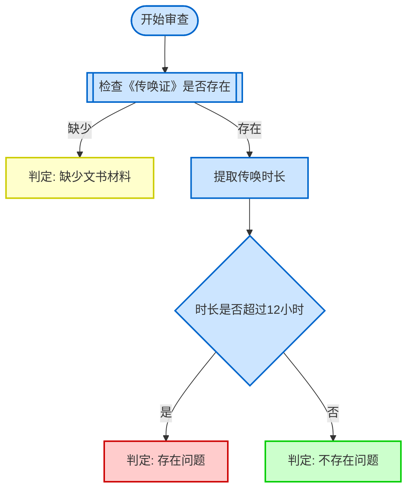

# Diagram Generation - 流程图生成

## 用途
为 Step 5 提供审查逻辑可视化生成规则，生成 Mermaid 流程图和 ASCII 流程图两种格式。

## Mermaid 流程图

### 节点类型
- `([Start/End])` — 圆角矩形，开始/结束
- `[Process Step]` — 矩形，操作步骤
- `{Decision Point}` — 菱形，条件分支
- `[[Document Check]]` — 双矩形，文书存在性检查

### 颜色编码
- `:::red` — 存在问题
- `:::green` — 不存在问题
- `:::yellow` — 缺少文书材料
- `:::blue` — 过程步骤和检查

### 生成规则
1. 以 `([开始审查]):::blue` 开始
2. 第一个主要步骤为文书存在性检查
3. 所有决策点必须有标注边 (`-->|label|`)
4. 每条路径必须通向三种结论之一:
   - `[判定: 存在问题]:::red`
   - `[判定: 不存在问题]:::green`
   - `[判定: 缺少文书材料]:::yellow`
5. 使用简洁中文标签
6. 无孤立节点

### 样式定义
```
classDef red fill:#ffcccc,stroke:#cc0000,stroke-width:2px
classDef green fill:#ccffcc,stroke:#00cc00,stroke-width:2px
classDef yellow fill:#ffffcc,stroke:#cccc00,stroke-width:2px
classDef blue fill:#cce5ff,stroke:#0066cc,stroke-width:2px
```

### 示例


## ASCII 流程图

### 字符
- `├─` 分支点 / `└─` 最后分支 / `│` 竖线 / `─` 横线
- `[✓]` 不存在问题 / `[✗]` 存在问题 / `[!]` 缺少文书 / `{?}` 决策点

### 生成规则
1. 标题: `审查流程图` + 分隔线
2. 缩进2空格表示层级
3. 结论标记: `[✓]`/`[✗]`/`[!]`
4. 决策点标记: `{?}`
5. 每行不超过60字符

### 示例
```
审查流程图：传唤时长合规性
═══════════════════════════════════════

开始审查
  │
  ├─ 第一步：检查《传唤证》
  │   ├─ 缺少 → [!] 判定：缺少文书材料
  │   └─ 存在 → 继续
  │
  ├─ 第二步：提取传唤时长
  │   └─ 计算到达时间与离开时间差值
  │
  └─ 第三步：判断时长
      ├─ {?} 超过12小时
      │   └─ [✗] 判定：存在问题
      └─ {?} 未超过12小时
          └─ [✓] 判定：不存在问题
```

## 展示格式

```
📊 审查逻辑可视化
━━━━━━━━━━━━━━━━━━━━━━━━━━━━━━━━━━

【Mermaid 流程图】
以下是交互式流程图（支持在Markdown渲染器中查看）：

[Mermaid 代码块]

【ASCII 流程图】
以下是纯文本流程图（适合所有环境）：

[ASCII 图]

━━━━━━━━━━━━━━━━━━━━━━━━━━━━━━━━━━
```

展示后与内容一起进入 Step 6 审查，不做单独确认。
